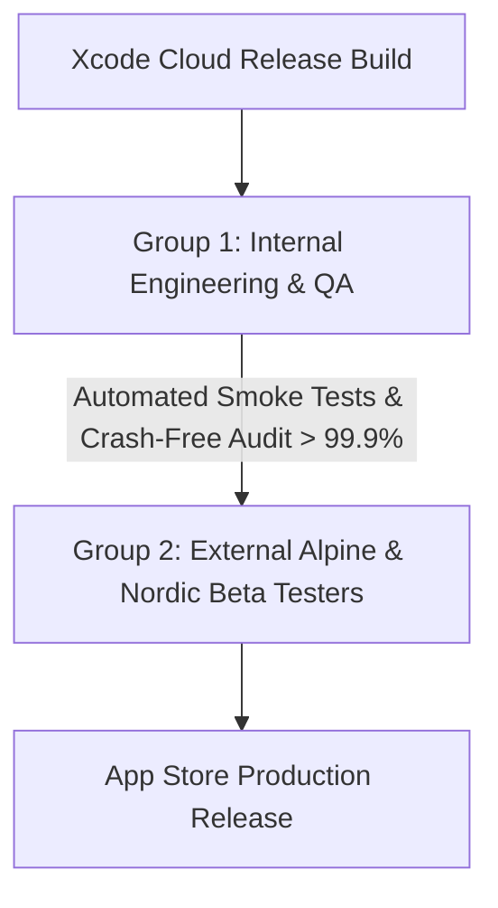

# Nordic Asset Suite — TestFlight Beta Distribution Protocol

## 1. Dual-Group TestFlight Architecture

---

## 2. Beta Testing Groups

### Group 1: Internal Engineering & QA (Continuous Deploy)
* **Audience:** Core iOS Engineering, Security, and QA team members.
* **Test Focus:**
  * Strict Swift 6 Concurrency and Actor thread sanitization.
  * Apple App Attest challenge validation and edge Cloudflare proxy routing.
  * In-memory vs SQLite App Group migration plans.
  * StoreKit 2 Sandbox purchases, cancellations, and family sharing.

### Group 2: External Alpine & Nordic Beta Testers (Staged Rollout)
* **Audience:** 250 targeted testers across Switzerland, Austria, Denmark, Norway, and Sweden.
* **Test Scenarios by Market:**
  * **Switzerland (CH - Zurich, Geneva, Lugano):** German (`de_CH`), French (`fr_CH`), Italian (`it_CH`) translations; CHF currency formatting with apostrophe (`1'250.00 CHF`); V-ZUG and Miele error code scanning; Stöckli ski binding DIN tests.
  * **Austria (AT - Innsbruck, Vienna):** German (`de_AT`); Alpine ski wax recommendations in extreme cold (-15°C); Bosch E-Bike mountain trail PSI setup.
  * **Denmark (DK - Copenhagen):** Danish (`da_DK`); DKK currency formatting; City commuter e-bike chain wear alerts; Jura coffee machine water hardness calibration.
  * **Norway & Sweden (NO/SE - Oslo, Stockholm):** Norwegian (`nb_NO`) and Swedish (`sv_SE`); Cross-country and alpine wax calculators; Nordic winter battery degradation monitoring.

---

## 3. Feedback Channels & Metrics
* **Crash-Free Sessions Threshold:** $\ge 99.9\%$
* **Feedback Ingestion:** Integrated Apple TestFlight Feedback Sheet + anonymized local diagnostics export.
